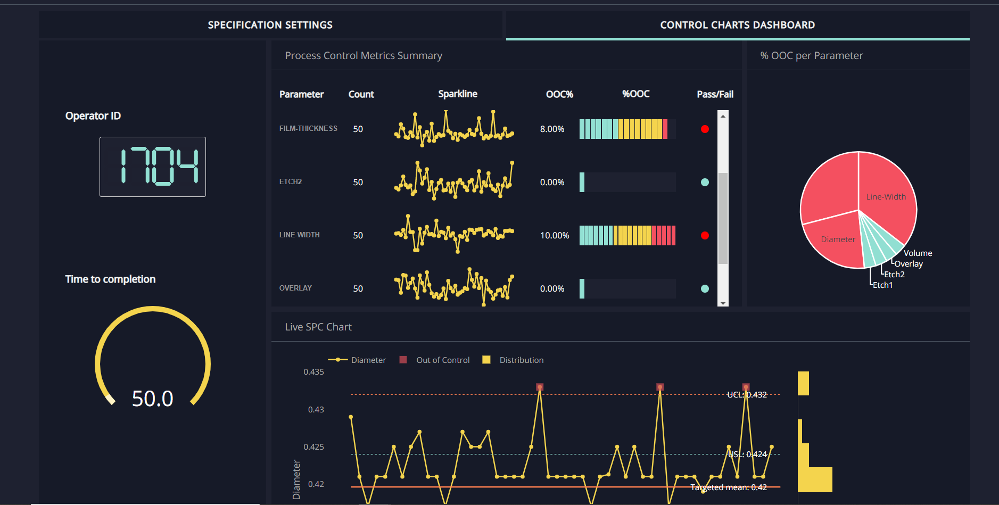

# InvestmentDashboard
This repo will contain :
*	**Portfolio Optimization and Re-balancing Strategy**
*	**Technical Market Indicators for Stock Trading**
*	**Stock Price Analysis with Deep Learning Sentiment Analysis**

To check more the Portfolio Opimization project:
* [PortfolioOptimization](https://github.com/junha1532/PortfolioOptimization)
